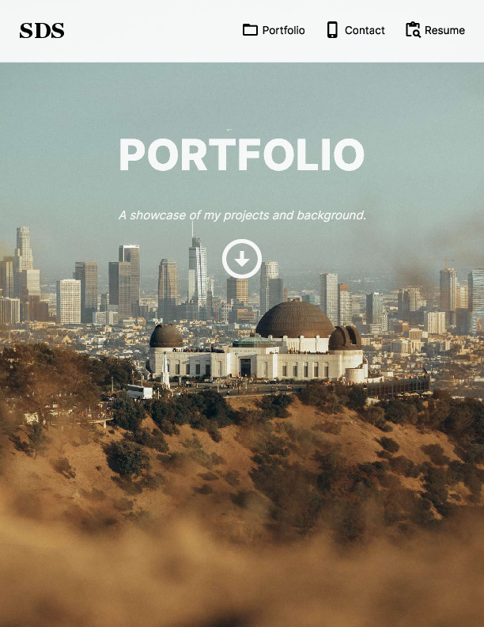

# Saim's Portfolio

## Description
This is my personal portfolio, where I've shared a number of personal and colaborative projects. This is a [Next.js](https://nextjs.org/) project bootstrapped with [`create-next-app`](https://github.com/vercel/next.js/tree/canary/packages/create-next-app).

## Table of Contents
- [Installation](#installation)
- [Usage](#usage)
- [License](#license)
- [Contributing](#contributing)
- [Tests](#tests)
- [Questions](#questions)

## Installation
This site utilizes npm for package management. Dependencies include react, react-dom, next, autoprefixer, @emotion/react, @emotion/styled, @mui/icons-material, and  @mui/material. Users can enter 'npm i' in the terminal in order to install all dependencies.

## Usage
A live version of this site can be found at: https://saims-portfolio-3140921072de.herokuapp.com/

## Liscense
None

## Contributing
There are no contribution guidelines.

## Tests
There are no test instructions.

## Questions
If you have any questions, you can contact me at [odiazstrandberg@gmail.com](mailto:odiazstrandberg@gmail.com). 
You can also find more of my work at [ojds2022](https://github.com/ojds2022).

